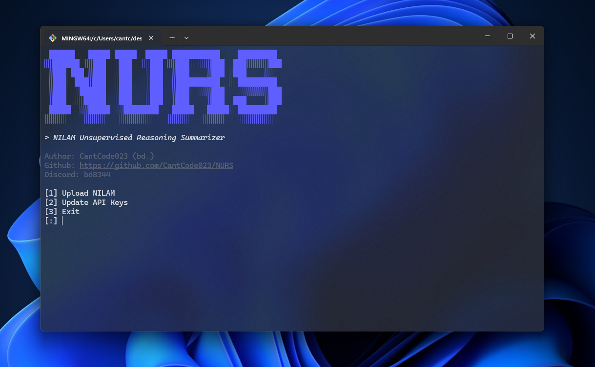

# NURS

NURS (NILAM Unsupervised Reasoning Summarizer) is an automated software tool designed to scrape, summarize, and process articles from Medium.com and uploads them to your AINS (Advanced Integration NILAM System) account (NURS AINS lol).

## Table of Contents
1. [Installation](#installation)
2. [Configuration](#configuration)
3. [Usage](#usage)
4. [Contributing](#contributing)
5. [License](#license)
6. [Support](#support)

---

## Installation

1. Clone the repository:
```bash
git clone https://github.com/CantCode023/NURS.git
```

2. Install required dependencies:
```bash
pip install -r NURS/requirements.txt
```

---

## Configuration

NURS requires two API keys to function:
- Gemini API Key (for content summarization)
- JB App Token (for authentication)

These can be configured in two ways:

1. Create a `.env` file in the project directory:
```
GEMINI_API_KEY=your_gemini_api_key
jb_app_token=your_jb_app_token
```

2. Input through CLI when prompted (if .env file is not found)

---

## Usage

1. Go into NURS directory
```bash
cd NURS
```

2. Run the CLI
```python
python __main__.py
```

---

### Main Menu Options
1. Upload NILAM
2. Update API Keys
3. Exit

---

### Uploading an Article
1. Select option 1 from the main menu
2. Enter the Medium article URL
3. Wait for the processing and summarization
4. Review the generated summary
5. Automatic upload to AINS

---

### Updating API Keys
1. Select option 2 from the main menu
2. Choose which key to update:
   - Gemini API Key
   - JB App Token
3. Enter the new key value

Here's a video demonstrating the process:

[](https://www.youtube.com/watch?v=3uQ3ZmgXQmE)

---

# Contributing

Please read the [CODE_OF_CONDUCT.md](CODE_OF_CONDUCT.md) for details on the code of conduct and the process for submitting pull requests.

---

# License

This project is licensed under the MIT License - see the [LICENSE](LICENSE) file for details.

---

# Support

For support or questions, contact:
- Email: cantcode023@gmail.com
- Discord: bd8344

---

This documentation will be updated as new features are added and existing ones are modified. For the latest updates, please refer to the project's GitHub repository.

---

# TODOLIST
- [x] Add function to scrape website text in text_processing.py
- [x] Make summarizer function using Google Gemini
- [x] Add functions to get provider key and bearer authorization
- [x] Use request to upload nilam
  - Make custom stars (int 1-5) and favourite (bool)
- [x] Add bad words filter in utils, make a custom exception in exceptions.py
  - Add other exceptions like bad api key, etc
- [x] Make cli
  - add cooldown between requests

# FUTURE TODOLIST
- [ ] Add News API support